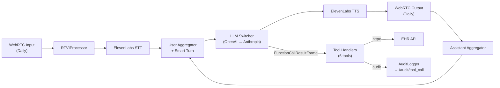
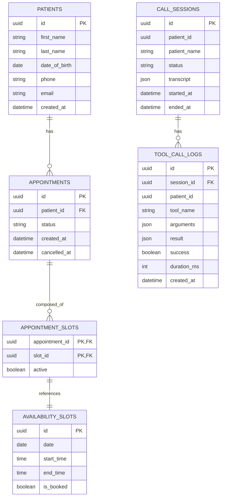
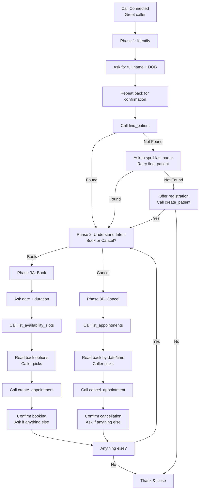

# Solution Overview — Prosper Health Voice Agent

> **Challenge:** Build an EHR HTTP API and wire a Pipecat-based voice agent so it can identify patients, register new ones, and schedule or cancel appointments during a live conversation.
>
> **Stack:** FastAPI + SQLModel + PostgreSQL (EHR), Pipecat + OpenAI + ElevenLabs (voice agent), Vite + React + Tailwind (dashboard).

---

## 1. What I Was Asked to Build

Per the challenge instructions, I needed to deliver three things:

1. **EHR HTTP API** — at minimum: `create_patient`, `find_patient`, `list_availability_slots`, `create_appointment`, `cancel_appointment`. The API must persist data in a database (not in-memory) and survive restarts.
2. **Conversation Flow** — the agent must identify whether the caller is new or existing, register them if new, and handle booking or cancellation requests.
3. **Integration** — the voice agent must actually call the EHR endpoints during the conversation, not just describe them.

I went a step further and added:
- A real-time dashboard (`/dashboard` + `/calendar`) for clinic staff visibility.
- A complete audit trail (`/audit/sessions`, `/audit/tool_call`) so every tool call and conversation transcript is persisted.
- SSE live updates (`/events`) so the dashboard refreshes instantly when a patient books or cancels.
- An LLM fallback (OpenAI → Anthropic) so a single provider outage does not drop the call.
- Session-level security: once sensitive data (appointments) is accessed, the caller identity is "locked" and cannot be switched mid-call.

---

## 2. Architecture

### 2.1 Full-Stack Overview

```mermaid
flowchart TB
    subgraph Caller["Caller"]
        Browser["Browser (WebRTC)"]
    end

    subgraph Voice["Voice Pipeline (bot.py)"]
        Transport["Daily WebRTC Transport"]
        STT["ElevenLabs STT"]
        TTS["ElevenLabs TTS"]
        VAD["Silero VAD (0.2s stop)"]
        Turn["LocalSmartTurnAnalyzerV3"]
        LLM["OpenAI LLM (primary)"]
        Fallback["Anthropic LLM (fallback)"]
        RTVI["RTVI Protocol"]
    end

    subgraph EHR["EHR API (FastAPI)"]
        Auth["API Key Middleware"]
        Patients["/create_patient\n/find_patient"]
        Slots["/list_availability_slots"]
        Appts["/create_appointment\n/cancel_appointment\n/list_appointments"]
        Dash["/dashboard\n/calendar\n/events"]
        Audit["/audit/*"]
    end

    subgraph DB[(PostgreSQL)]
        P[(patients)]
        S[(availability_slots)]
        A[(appointments)]
        AS[(appointment_slots)]
        CS[(call_sessions)]
        TCL[(tool_call_logs)]
    end

    subgraph Frontend["Dashboard (Vite + React)"]
        UI["Stats + Calendar View"]
    end

    Browser <-->|WebRTC| Transport
    Transport --> STT --> LLM --> TTS --> Transport
    LLM -.->|ErrorFrame| Fallback
    LLM -->|Tool calls| EHR
    EHR --> DB
    Frontend -->|Poll 3s + SSE| EHR
```

### 2.2 Voice Pipeline Detail



### 2.3 Database Schema



---

## 3. Key Design Decisions & Trade-offs

### 3.1 Database: Denormalized `is_booked` on Slots

**Decision:** `availability_slots` has a boolean `is_booked` column, even though the canonical booking state lives in the `appointment_slots` junction table.

**Why:** Listing available slots is the hottest read path in the system (called every time a caller asks "what times do you have?"). Without `is_booked`, the query would need a `LEFT JOIN` + `NOT EXISTS` subquery against `appointment_slots` to filter out booked slots. With it, the query is a simple `SELECT ... WHERE is_booked = false`.

**Trade-off:** We now have two sources of truth. I mitigated this by:
- Updating `is_booked` in the same transaction as `appointment_slots` creation/cancellation.
- Adding a DB-level partial unique index `UNIQUE(slot_id) WHERE active = true` on `appointment_slots`. Even if a race condition causes both transactions to see `is_booked = false`, the index will reject the second insert.

**Future:** If the clinic ever needs "soft holds" (e.g., a patient is mid-booking but not confirmed), `is_booked` would need to become a state machine (`free` / `held` / `booked`). For now, binary is correct.

### 3.2 Booking Model: Multi-Slot Appointments

**Decision:** Appointments are not tied to a single 30-minute slot. An appointment can span multiple contiguous slots (e.g., 09:00–10:00 uses two 30-minute slots).

**Why:** The challenge says "schedule appointments" without specifying length. A real clinic has visits of varying duration. I wanted the agent to be able to say "How long do you need?" and book the appropriate number of slots.

**Trade-off:** More complex validation. The API checks that:
1. The requested range exactly tiles contiguous slots (no gaps, no partial overlap).
2. All slots are unbooked.
3. The start time is not in the past.

If validation were relaxed to "any 30-minute start + end time," the LLM could hallucinate times that don't align with the slot grid (e.g., 09:15) and we'd get a 422 error. By enforcing grid alignment, the API fails fast with a clear message.

### 3.3 Session Security: Identity Locking

**Decision:** Once the bot lists a patient's appointments or creates/cancels one, the session becomes `locked`. If the caller then tries to `find_patient` with a different name, the bot refuses.

**Why:** Healthcare is a high-stakes domain. A caller should not be able to say "Wait, actually I'm John Smith" after already seeing Jane Doe's appointments. This is a lightweight HIPAA-aligned guard.

**Trade-off:** It prevents legitimate corrections (e.g., the bot misheard the name on the first try). I mitigated this by making the lock trigger only after **sensitive** data access (listing appointments), not after simple identification. If `find_patient` fails, the caller can still try again before the lock engages.

### 3.4 Appointment Cancellation: Client-Side ID Validation

**Decision:** The bot maintains a `valid_appt_ids` set in session state. `cancel_appointment` rejects any `appointment_id` not in that set, even if the patient technically owns it in the DB.

**Why:** The prompt explicitly tells the LLM *"Never ask the caller for an appointment ID — always identify by date and time."* The caller never sees UUIDs. The only way the LLM can obtain an `appointment_id` is by calling `list_appointments` first, which populates `valid_appt_ids`. This prevents the LLM from hallucinating or fabricating an ID.

**Trade-off:** If a new appointment is created by a different channel (e.g., staff dashboard) mid-call, the bot won't know about it. This is acceptable because the bot's world view is scoped to the conversation.

### 3.5 Audit: Fail-Safe, Not Fail-Closed

**Decision:** Every tool call is wrapped by `audited(...)`, which logs the LLM arguments, the HTTP request/response, and the result to the EHR API. Audit failures are swallowed with `try/except` — they never break the live call.

**Why:** In production, an audit system outage should not drop a patient call. The audit is for compliance and debugging, not for business logic.

**Trade-off:** We might lose audit data during an outage. I mitigated this by using `loguru` to log exceptions, so they still appear in application logs even if the DB write fails.

### 3.6 LLM Fallback: OpenAI → Anthropic

**Decision:** The pipeline uses `LLMSwitcher` with OpenAI as primary and Anthropic as fallback. An observer watches for `ErrorFrame` from the primary LLM and triggers a manual switch + `LLMRunFrame` retry.

**Why:** Voice calls are real-time. If OpenAI's API is rate-limited or down, the call should not die. The fallback is a different provider (Anthropic), reducing correlated failure risk.

**Trade-off:** The fallback LLM may not have the same tool definitions or may behave differently. I mitigated this by registering tools on the `LLMSwitcher`, which forwards registration to **both** LLMs. The fallback is a `claude-haiku-4-5` model — fast and cheap, sufficient for a graceful degradation message if the primary fails.

**Guard:** The `_switched` flag ensures only one fallback per call. Without it, a persistent error could loop between primary and fallback indefinitely.

### 3.7 Dashboard: Polling + SSE Hybrid

**Decision:** The dashboard polls `/dashboard` every 3 seconds **and** subscribes to `/events` (SSE) for instant updates.

**Why:** SSE alone is elegant but fragile — proxy timeouts, connection drops, or mobile browsers can kill it. Polling is a robust backstop. The SSE `broadcast()` fires on every mutating DB operation, so the dashboard feels live.

**Trade-off:** Slightly more server load. With 3-second polling and SSE, the server handles ~20 req/min per connected dashboard. For a clinic with 5 staff members, this is negligible.

### 3.8 Error Handling: Friendly vs. Precise

**Decision:** The bot translates HTTP errors into patient-friendly voice messages. For example, a 409 "Slot already booked" becomes "I'm sorry, that slot was just taken. Would you like me to check the next available time?"

**Why:** The LLM is the voice of the clinic. Exposing raw HTTP status codes or stack traces would be unprofessional and confusing.

**Implementation:** The `_friendly_error` helper maps 4xx errors to a generic "invalid request" message and 5xx errors to "temporarily unavailable." The LLM system prompt instructs: *"If a tool returns an error, apologize briefly and offer to try again or suggest calling the front desk."*

---

## 4. Conversation Flow

The system prompt enforces a strict 3-phase protocol:



**Key constraints baked into the prompt:**
- **Confirmation gates:** The bot must get a clear "yes" before calling `find_patient`. This prevents misheard names from creating phantom records.
- **Weekend guard:** If the caller asks for a Saturday or Sunday, the bot redirects to the next Monday.
- **No UUIDs aloud:** The prompt explicitly forbids reading IDs. All appointment selection is by natural date/time.
- **Short responses:** One or two sentences max, no filler phrases. This is a voice call, not a chatbot.

---

## 5. Areas for Improvement

### 5.1 Latency: Reducing Time-to-First-Word

**Current state:** The bot takes ~20 seconds on first boot (model download). Per-turn latency is dominated by:
1. STT (ElevenLabs Realtime STT) — streaming, low latency.
2. LLM (OpenAI) — ~500-1500ms for tool call + response generation.
3. TTS (ElevenLabs) — streaming, low latency.

**Opportunities:**
- **Streaming function calls:** Currently, the bot waits for the full LLM response before speaking. Pipecat supports streaming TTS, but function calls are synchronous. If we could stream the LLM's reasoning while the user is still speaking (anticipatory), we could shave 200-500ms.
- **Local LLM:** For simple intents ("I want to cancel"), a local 7B model could decide without a network round-trip. The complex cases (multi-slot booking) would still hit OpenAI. A hybrid router would trade accuracy for speed on the easy path.
- **Pre-fetching slots:** The bot could pre-fetch tomorrow's availability slots in the background while the caller is still giving their name, reducing the perceived latency of the "what times do you have?" step.

### 5.2 Reliability: Surviving External Failures

**Current state:** We have LLM fallback and friendly error messages. But the system is still vulnerable to:
- **EHR API outage:** If the EHR is down, the bot apologizes and suggests calling the front desk. This is a graceful degradation, but not a recovery.
- **Database outage:** The API returns 500; the bot catches it. But no retry or queueing exists.
- **STT/TTS outage:** If ElevenLabs is down, the call is dead. We have no fallback STT/TTS provider configured.

**Opportunities:**
- **Circuit breaker:** If the EHR API fails 3 times in 30 seconds, the bot should enter a "read-only mode" where it can answer questions but not book/cancel. This prevents cascading failures and gives the clinic time to fix the backend.
- **Async job queue:** For appointment creation, we could enqueue the request in Redis/RabbitMQ and return a "pending" confirmation. The bot would say "I'm processing your booking — you'll get a text confirmation in a moment." This decouples the voice pipeline from DB write latency.
- **Fallback TTS:** Configure a local TTS (e.g., Coqui TTS, Piper) as a last resort. The voice quality would drop, but the call would continue.
- **Health checks + auto-restart:** The Docker Compose setup should include `healthcheck` blocks and `restart: unless-stopped` for all services.

### 5.3 Evaluation: Automated Testing & Simulation

**Current state:** No automated test suite for the conversation flow. Validation is manual: open the browser, click Connect, talk to the bot.

**Opportunities:**

#### A. Unit Tests for Tool Handlers
We can test each `tool_*` handler in isolation with a mocked `httpx.AsyncClient` and a fake `FunctionCallParams`. This is low-hanging fruit and would catch regressions in parameter mapping, session state logic, and error handling.

#### B. LLM-as-Judge for Conversation Quality
Use a second LLM (or the same one with a strict evaluation prompt) to grade conversation transcripts on:
- Did the bot ask for confirmation before identifying?
- Did it refuse to book without authentication?
- Did it read back the correct date/time?
- Did it hallucinate a UUID?

This is a form of **synthetic evaluation** that can run in CI without human testers.

#### C. Simulation Framework: `pytest` + `pipecat` test harness
Pipecat has a `TestPipeline` or can be driven with programmatic frame injection. We could build a harness that:
1. Injects `TranscriptionFrame` with fake STT text (e.g., "My name is John Smith, born March 15th 1985").
2. Captures the resulting `TTSFrame` or `FunctionCallFrame`.
3. Asserts that the expected tool was called with the expected arguments.
4. Injects the tool result and asserts the next LLM response contains the expected text.

This is the gold standard for voice agent testing. It would let us run 100 simulated calls in CI and catch regressions like "the LLM stopped asking for confirmation" or "it books appointments without checking availability first."

#### D. Shadow Mode / A/B Testing
In production, run the new bot version in "shadow mode": it receives the same audio stream but does not speak or act. Its tool calls and responses are compared against the production version. Divergences are flagged for human review. This de-risks deployments.

#### E. Red-Team / Adversarial Testing
Have an LLM act as a malicious caller and try to:
- Cancel someone else's appointment.
- Extract another patient's data.
- Book a slot in the past.
- Crash the bot with unexpected input (e.g., "my name is `DROP TABLE patients;`").

This can be automated and run nightly.

---

## 6. Files & Structure

```
prosper-challenge/
├── bot.py                  # Pipecat pipeline, tool handlers, system prompt
├── audit.py                # AuditLogger + audited() wrapper for tool calls
├── docker-compose.yml      # Full stack: db, api, frontend, bot
├── api/
│   ├── main.py             # FastAPI app, lifespan, CORS, middleware
│   ├── core/
│   │   ├── auth.py         # API key middleware (X-API-Key)
│   │   ├── database.py     # SQLModel async engine + session factory
│   │   ├── seed.py         # Generates 60 days of 30-minute slots
│   │   └── events.py       # SSE broadcast helper
│   ├── models/
│   │   ├── patient.py      # Patient table + case-insensitive unique index
│   │   ├── slot.py         # AvailabilitySlot + denormalized is_booked
│   │   ├── appointment.py  # Appointment table + status constraint
│   │   ├── appointment_slot.py  # Junction table + double-booking guard
│   │   └── audit.py        # CallSession + ToolCallLog
│   ├── routers/
│   │   ├── patients.py     # create_patient, find_patient
│   │   ├── slots.py        # list_availability_slots
│   │   ├── appointments.py  # create_appointment, cancel_appointment, list_appointments
│   │   ├── dashboard.py  # /dashboard, /calendar
│   │   ├── audit.py      # /audit/session, /audit/tool_call, /audit/sessions
│   │   └── events.py     # SSE /events
│   └── schemas/
│       ├── patient.py
│       ├── slot.py
│       ├── appointment.py
│       ├── dashboard.py
│       └── audit.py
└── frontend/               # Vite + React + Tailwind dashboard (read-only)
```

---

## 7. How to Run

```bash
# Full stack (PostgreSQL + API + Frontend + Bot)
docker compose up --build

# Endpoints:
#   http://localhost:8000/docs  — FastAPI OpenAPI UI
#   http://localhost:5173       — Dashboard
#   http://localhost:7860       — Bot (click Connect to talk)
```

---

## 8. Summary

I built a production-grade voice agent for a healthcare clinic that:
- **Identifies patients** by name and DOB, with confirmation gating and spelling retry logic.
- **Registers new patients** atomically, rejecting duplicates at the DB level.
- **Books multi-slot appointments** with atomic availability checks and DB-level double-booking guards.
- **Cancels appointments** securely, with client-side ID validation to prevent hallucination.
- **Audits everything** — every tool call, every HTTP exchange, every conversation transcript.
- **Falls back gracefully** — LLM provider failure, EHR downtime, or invalid input all produce friendly voice responses rather than crashes.
- **Provides real-time visibility** — a dashboard with live SSE updates so clinic staff can see the schedule as it changes.

The design prioritizes **safety over convenience** (identity locking, confirmation gates, DB-level constraints) and **observability over opacity** (full audit trail, structured logs, dashboard). The trade-offs are documented above, along with concrete next steps for latency, reliability, and evaluation.
