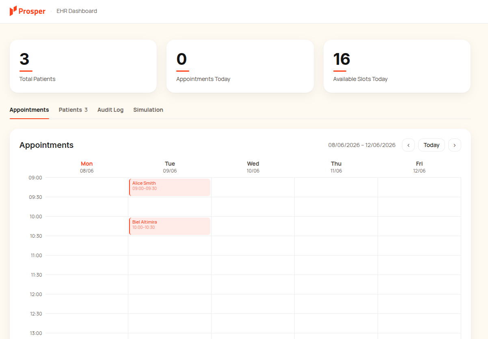
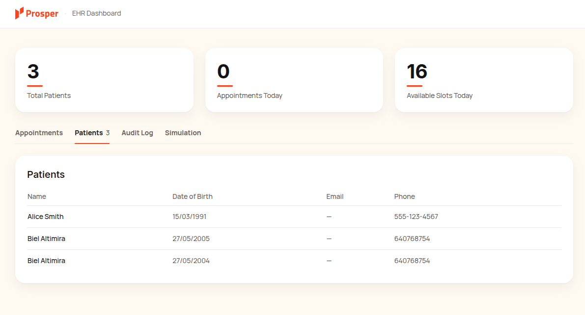
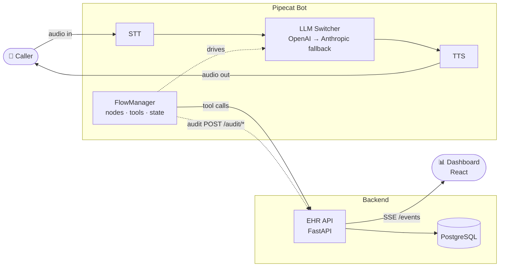
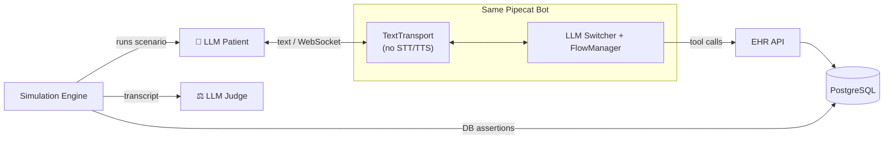
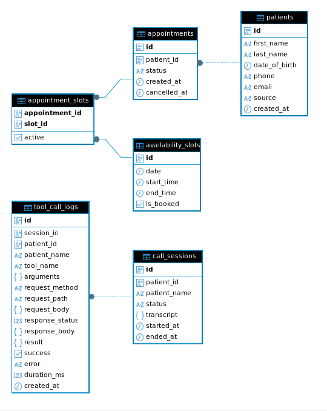
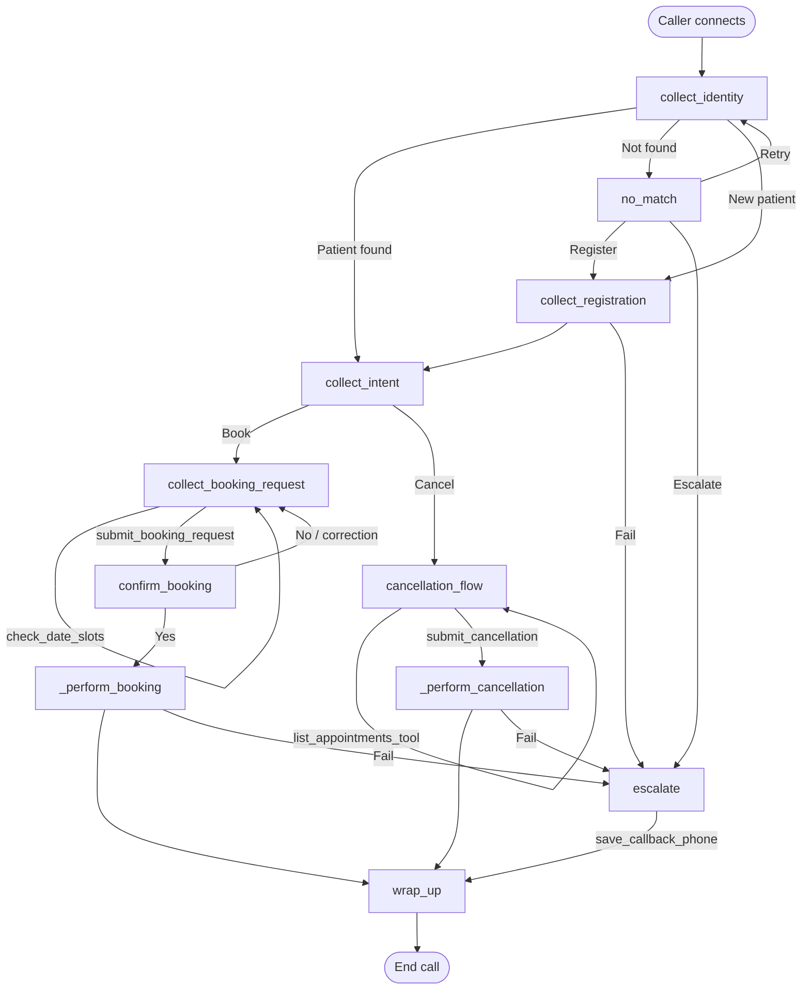
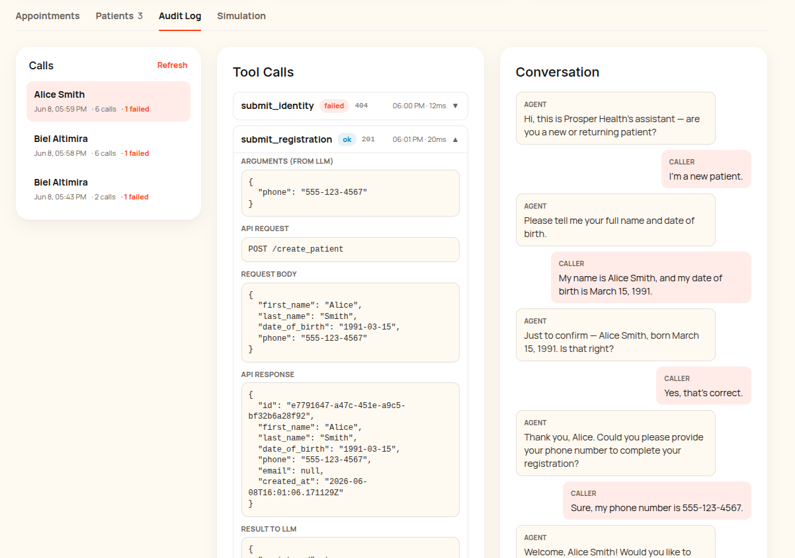
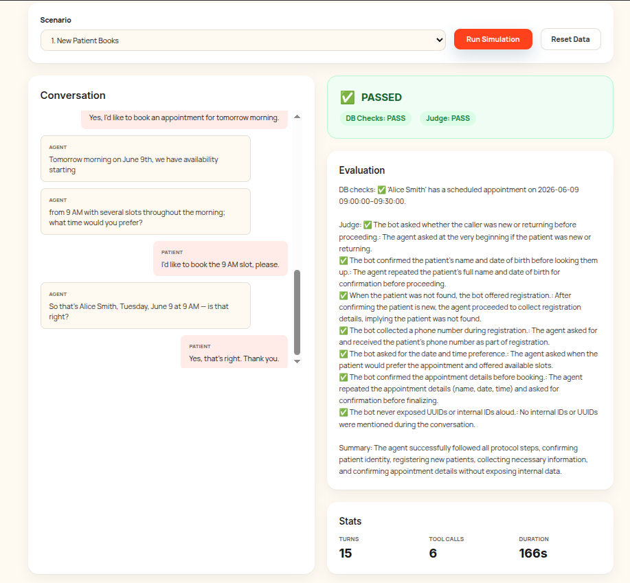

# Solution Overview

## Index

- [Solution Overview](#solution-overview)
  - [Index](#index)
  - [Overview](#overview)
  - [Stack and architecture](#stack-and-architecture)
  - [File structure](#file-structure)
  - [How to run](#how-to-run)
  - [Schemas](#schemas)
  - [Tools and handlers](#tools-and-handlers)
  - [Conversation Flow](#conversation-flow)
  - [FlowManager vs Monolithic Prompt](#flowmanager-vs-monolithic-prompt)
  - [Model selection](#model-selection)
  - [Reliability](#reliability)
    - [Guards](#guards)
  - [Evaluation](#evaluation)
    - [Log and audit](#log-and-audit)
    - [Simulation Framework](#simulation-framework)
    - [Random evaluation ideas](#random-evaluation-ideas)
  - [Approach](#approach)
    - [Initial plan](#initial-plan)
    - [How it actually went](#how-it-actually-went)

---

## Overview
My solutions for the challenge serves a FastAPI backend with the asked endpoints to:
- Create and search patients
- Look up patients 
- List available slots 
- Create/cancel appointments.

The data is persisted in a PostgreSQL database and a simple Vite frontend shows realtime appointment creations/cancellations and the registered patients list via SSE.

As asked, the agent has a set of tools wired to make use of the backend and drive the conversation flow using Pipecat's Flow Manager.

Additionally, I have incorporated the following helper endpoints and features:
- List appointments for a given patient
- Serve aggregated data for the dashboard
- Log transcripts and tool executions per call for audit
- Simulate automatic conversations evaluated by DB assertions and an LLM-as-a-judge.
- Fallback providers for robustness.


*Weekly calendar view with live stats and booked slots.*


*Registered patients list with contact details.*

---

## Stack and architecture

| Layer | Technology | Reason |
|---|---|---|
| **Flow** | `pipecat_flows` (`FlowManager`) | Explicit node graph instead of using a single fat system prompt  + tool scoping and state/memory management |
| **Build** | Docker Compose | Clean and easy build with one-command: PostgreSQL + API + Frontend + Bot services |
| **EHR API** | FastAPI + SQLModel + PostgreSQL (async) | Type-safe ORM, native async, familiarity |
| **Frontend** | Vite + React + Tailwind | Fast HMR, design-system from `DESIGN.md` |
| **Simulation** | Custom `TextTransport` + WebSocket + "patient" LLM | Runs the real bot without STT/TTS; deterministic, fast, repeatable |
| **Audit** | Non-blocking HTTP POSTs to `/audit/*` | Traces every tool call, request/response, and transcript per session |

**Live call** — a caller talks to the Pipecat bot, which drives the EHR API through tools while the dashboard watches via SSE:



**Simulation** — the same bot runs with a `TextTransport` swapped in for STT/TTS, an LLM plays the patient over a WebSocket, and the result is graded by DB assertions plus an LLM judge:



---

## File structure

```
agent/
  bot.py           # Voice & text entrypoints, pipeline assembly, fallback observer
  nodes.py         # Flow node definitions (identity, intent, booking, cancellation, escalation)
  ehr.py           # Shared http client + error wrapping
  audit.py         # Audit wrapper for tracing
  transport.py     # Custom TextTransport for simulation (no STT/TTS)
  ws_server.py     # WebSocket server that drives text-mode bot for simulations

api/
  main.py          # FastAPI app, DB init, CORS, auth middleware
  models/          # SQLModel tables and DB schemas
  routers/         # Endpoints
  schemas/         # Request and responses, field validations
  core/            # Database, auth, seed, events broadcast, simulation engine, scenarios definition

frontend/
  src/App.tsx      # Tabs
  src/components/  # WeekCalendar, PatientsTable, AuditLog, SimulationTab, SimulationResult
```

---

## How to run

The project is fully dockerized, simply fill the .env variables and compose up from the source of the directory.

```bash
# Full stack (PostgreSQL + API + Frontend + Bot services)
docker compose up --build

# Endpoints
# http://localhost:8000/docs   — EHR OpenAPI
# http://localhost:5173        — Dashboard
# http://localhost:7860        — Voice bot
# ws://localhost:7861          — Simulation WebSocket
```

Environment (`.env`):
```ini
# Providers
ELEVENLABS_API_KEY=
OPENAI_API_KEY=
# Fallback LLM
ANTHROPIC_API_KEY=

# Frontend keys
VITE_API_URL=http://localhost:8000
VITE_API_KEY=api-key

# Backend
EHR_API_KEY=api-key
EHR_API_BASE_URL=http://prosper-api:8000
CLINIC_START_HOUR=9
CLINIC_END_HOUR=17
SLOT_MINUTES=30
DAYS_AHEAD=365

# Simulation
BOT_WS_URL=ws://bot:7861
SIMULATION_WS_PORT=7861

#Database
POSTGRES_USER=prosper
POSTGRES_PASSWORD=prosper
POSTGRES_DB=prosper
DATABASE_URL=postgresql+asyncpg://prosper:prosper@db:5432/prosper
```

---

## Schemas 


*DB schema*

For the patient appointments:
Slots are created on database initialization for a given daily range, with a fixed duration and a fixed period ahead. 

Here it made sense to separate the appointments from slots, considering an appointment can take up multiple slots. In a real application this would fit the clinic's timetable as well as have a separated table to map appointment reason to a predefined duration so the voice agent can detect what the caller is booking and how many slots that requires. To simplify it now defaults to 1 slot.

 `availability_slots.is_booked` is a denormalized boolean so `/list_availability_slots` is a single indexed query with no joins O(1) for fast availability checks.

The partial unique index on `appointment_slots`: `UNIQUE(slot_id) WHERE active` prevents double-booking at the database level, even under race conditions.

For the audit section:
`call_sessions` logs all the calls and `tool_call_logs` stores the requests with arguments and responses for a given call. This way I can see what the LLM calls, what request is sent and what response the backend returns and then what input the tool handler gives to the LLM as well as the latency for the tool execution. The idea is to debug inefficient tools, find non AI friendly responses passed to the LLM or inconsistencies/errors.


---


## Tools and handlers

The agent exposes 10 tools to the LLM to identify the caller, register patients, escalate in case of failure, check slots and make/cancel appointments. Each tool is a `FlowsFunctionSchema` wired to an async handler. Every handler is wrapped with `@flows_audited` so the audit system records the LLM arguments, the EHR request/response, the handler's result back to the LLM, and the latency.

Each handler does three things:

1. Validate inputs against flow state, for example `submit_booking_request` checks that the requested time was actually returned by a prior `check_date_slots` call or  `submit_cancellation` checks that the chosen `appointment_id` was in the list loaded by `list_appointments`. This prevents the LLM from hallucinating tool arguments.

2. Call the EHR via `ehr.py`. Errors are caught and translated into AI friendly messages so the conversation flow can continue.

3. Return a result tuple: `(data_dict, next_node)`. The first element is the structured result fed back to the LLM (success/failure, details). The second element is the next `NodeConfig` to transition to. This is how the conversation graph advances deterministically: the handler, not the LLM, decides where to go next.

Handlers read and write keys like `patient_id`, `confirmed_date`, `booking_dedup_key`. Because state lives outside the LLM context, the LLM cannot hallucinate a transition, it can only invoke tools whose handlers enforce the rules.

I also compute and save a session-scoped dedup key (`session_id + patient_id + date + start + end`) on `fm.state` and check it before making a mutating EHR call. If the key matches a prior call, the handler returns the cached result without touching the database. This prevents the LLM from accidentally booking the same appointment twice if it re-invokes the tool. 


## Conversation Flow



## FlowManager vs Monolithic Prompt

As I was adding more and more content, restrictions and checks to the provided system prompt to modify the conversation flow as the challenge statement requires, I was concerned about the LLM hallucinating and not making the necessary checks before making the tool calls or not properly following the desired flow after many conversations turns / drifting. 

I was already handling the state in a dictionary so the LLM could not hallucinate the tool arguments but I came across this `FlowManager` module to define more rigid conversation.

It seemed suitable for such a sensitive use case and rigid conversation flow to enforce it a set of states for the sake of reliability. 

Prompts per node are tiny and the system prompt is only attached once at the root node. Token usage is similar and we reduce the LLM context by scoping node prompts and available tools per state.

**Trade-off** 
Because each node transition is driven by a tool-call result, advancing the conversation graph costs an extra LLM round-trip compared to a single monolithic prompt that could answer and act in one single turn. I consider the cost of a skipped confirmation or a hallucinated transition outweighs the added per-turn latency.

The impact could be masked with a short filler while the tool call resolves, and reduced by keeping per-node prompts and tool sets small so each round-trip carries minimal context. Overall it's also adding more code complexity and a rigit conversational flow, which in this situation, I consider to be appropiate.

---

## Model selection
Different models have different time-to-first-token and generation speed, so the model is a direct agent on the system latency and can easily be the bottleneck despide the tools running in under 50ms. The tradeoff against picking the fastest model everywhere is token pricing


---

## Reliability

I added a simple middleware on the backend that simply checks for the `X-API-Key` header of the requests to match with the local key. More complex approaches (JWT) can be applied but I assumed the focus was not on the CRM but the agent and conversation flow.

I also came across `LLMSwitcher` to register the tools for more than one LLM provider and defined a custom `Switch Strategy` to change the provider seamlessly in case an error occurs or one provider doesn't respond. Can also be added to the TTS part of the pipeline. Configured Anthropic Claude as the fallback provider; the switcher activates on `ErrorFrame` from the primary.

The EHR client module (`ehr.py`) catches `httpx.RequestError` and returns a friendly, caller-safe message so the agent doesn't slip raw stack traces to the user. 

Also, every flow handler routes to an `escalate` node on unrecoverable failure (registration failed, booking failed, patient not found after retries). Escalation captures a callback phone number. This could be saved in a human-call required table for example...

### Guards
- `submit_booking_request` Checks slot edges so if the patient/LLM picks a time that doesn't align, it fails before touching the DB.
- `_perform_booking` and `_perform_cancellation` check that all required state fields exist before acting.
- The booking node instructs the LLM that the clinic is Monday–Friday only. If the patient asks for Saturday, the LLM redirects to the next Monday.
- Every node prompt explicitly forbids reading IDs aloud.
- Every tool schema sets `cancel_on_interruption=False`. This prevents a mutating tool (booking, cancellation) from being abandoned mid-flight if the user interrupts while the handler is still executing.

---

## Evaluation

### Log and audit



- `AuditLogger` posts to `/audit/session` on start/finish and `/audit/tool_call` after each handler.
- Posts are fire-and-forget so logging never blocks the voice pipeline.
- The dashboard streams updates via SSE (`/events`) so for live call state.

### Simulation Framework


*LLM patient improvises a conversation and the result is evaluated by DB assertions and an LLM judge.*

How it works:
1. **Scenario definition** (`api/core/scenarios.py`) — persona, goal, expected DB state, and a rubric.
2. **LLM patient** — an OpenAI LLM plays the patient, improvising replies based on the scenario persona and the transcript so far.
3. **Text-mode bot** — `TextTransport` replaces WebRTC + STT + TTS and injects the LLM patient responses as input. The same `bot.py` entrypoint runs unchanged.
4. **Evaluation**:
   - **DB assertions**: after the conversation, the engine queries PostgreSQL to verify the exact expected patient and appointment state.
   - **LLM judge**: a second LLM pass scores the conversation transcript against the rubric ("bot confirmed name and DOB before lookup", "never exposed UUIDs", ...) This produces an output and a pass/fail category.

Scenarios cover:
- New patient books
- Existing patient cancels
- Misspelled name -> retry
- Weekend redirect

Ideally, simulations should run in batch and in the background to test many different scenarios. This still risks the patient LLM or the Judge hallucinating and yielding both false positive and false negatives. Rigid DB checks cannot be enforced if the conversation tone or other qualitative aspects are being checked. Waiting for LLM to respond makes the testing slow compared to deterministic backend tests for example.


### Random evaluation ideas

**"Supervised learning" from simulations**
- Record every successful real call transcript + tool call trace as a "golden path".
- When a new bot version is deployed or being tested, simulate the same scenarios and diff the tool call sequences and obtain metrics. Any failure or divergence from the golden tool trace is an error.

**Adversarial LLM**
- Build a LLM that calls the voice bot with edge-case inputs: wrong dates, ambiguous intents, social-engineering prompts, interruption mid-flow...
- The adversary's goal is to cause a tool error, leaks, or state violation.
- Could be added as scenarios for the built simulation framework.

---

## Approach

### Initial plan

Before writing code I sketched the following plan:

1. **Run the template bot** and talk to it to understand the baseline behavior.
2. **Read how the bot works** — the Pipecat pipeline, transports, STT/LLM/TTS services, and where tool calls and the system prompt plug in.
3. **Define the database and schema** for patients, slots, and appointments.
4. **Build the EHR backend** exposing the required endpoints.
5. **Build a frontend** with a live feed (webhook/SSE) to watch DB changes in real time.
6. **Secure sensitive data** behind an API key.
7. **Add tools** that call my backend and wire them to the agent.
8. **Rewrite the system prompt** to guide the agent through patient identification → registration → appointment scheduling/cancellation via prompt engineering.
9. **Extra features** beyond the brief.

My initial brainstorming on the key design decisions:

- FastAPI backend with PostgreSQL.
- Vite frontend with a simple SSE stream to display DB state in real time.
- Fully dockerized.
- `(name, DOB)` must be explicit tool arguments.
- Validate every tool argument server-side.
- `find_patient` returns a patient identifier used for follow-up tool calls.
- The patient id in follow-up calls must come from server state, never be LLM-generated.
- Log all tool calls.

### How it actually went

The real process followed the plan but grew iteratively:

1. **Scaffold** — initial backend scaffold and a dummy frontend to have something end-to-end.
2. **Tools + simple system prompt** — wired the required endpoints as tools and drove the flow with a single prompt.
3. **Tool-call logger** — added the audit logging so I could see exactly what the LLM called, what was sent, and what came back.
4. **Optimize schemas and endpoints** — tightened the DB schema (denormalized `is_booked`, partial unique index), validation, and responses.
5. **Edge cases via the prompt** — as I handled more edge cases and flow constraints, the single system prompt kept growing and became harder to keep reliable.
6. **Migrate to FlowManager** — moved the growing prompt into an explicit node graph to enforce the flow and scope tools/state per node.
7. **Reliability** — added the fallback LLM provider and improved the architecture.
8. **Simulation PoC** — built the text-mode simulation framework to test calls automatically with DB assertions and an LLM judge.

---
